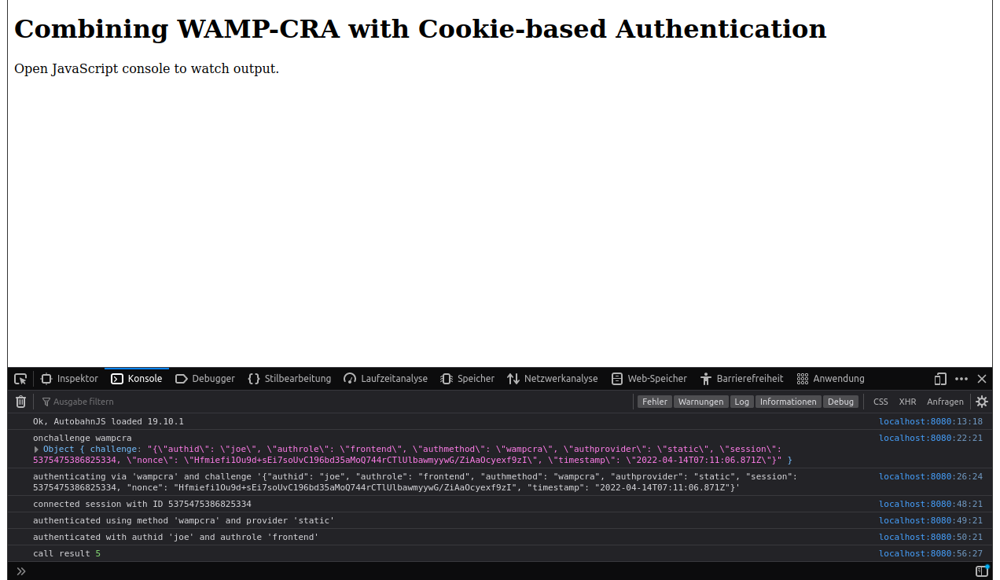
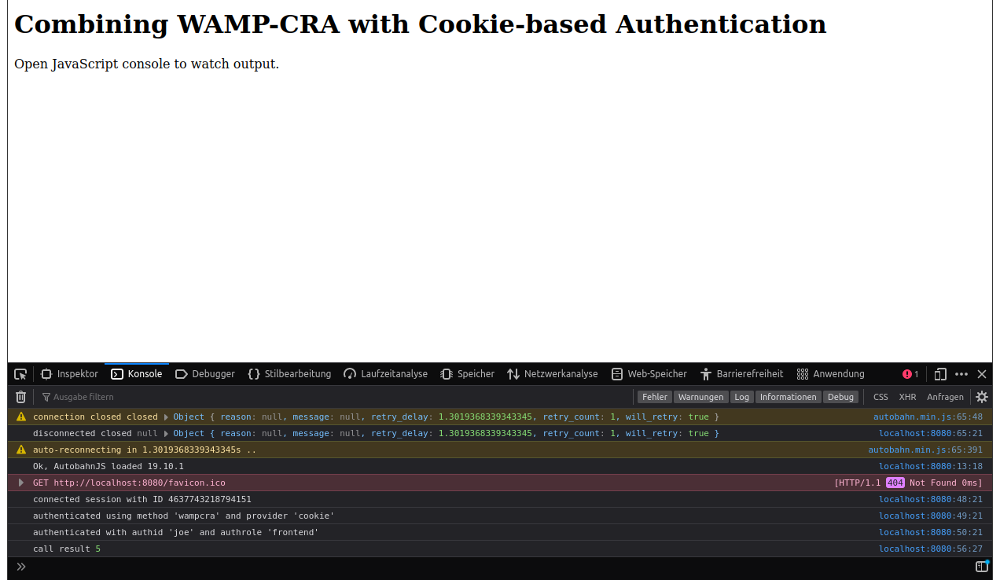

To run this example

    crossbar start

Then open [`http://localhost:8080`](http://localhost:8080) in your browser. Open the JavaScript console.

The **first time** you open this page you should see a log similar to this (note the **authenticated using method 'wampcra' and provider 'static'** log line):



What you can see from above log is that the client announced to be willing to authenticate using `authmethods == ["cookie","wampcra"]`.

Crossbar.io decided to go with `wampcra` and send an authentication `CHALLENGE`  message to the client, which the client responded to with a signature.

The client is then accepted, and Crossbar.io informs about the effective authentication that was used: `"authmethod": "wampcra"` and `"authprovider": "static"`.

The **second time** you open this page you should see a log similar to this (note the **authenticated using method 'wampcra' and provider 'cookie'** log line):



As you can see, this time Crossbar.io directly accepted the client. It also informs the client that it was using `"authmethod": "wampcra"` and `"authprovider": "cookie"`.

This is reflected in the cookie file where Crossbar.io persists the cookies:

```console
(python279_1)oberstet@thinkpad-t430s:~/scm/crossbar/crossbarexamples/authenticate/cookie$ cat .crossbar/cookies.dat
{"max_age": 604800, "authid": null, "authrole": null, "authmethod": null, "created": "2015-08-24T13:45:33.381Z", "id": "MXRQadHFItz75_-FSxk9g-xg"}
{"max_age": 604800, "authid": "joe", "authrole": "frontend", "authmethod": "wampcra", "modified": "2015-08-24T13:45:33.381Z", "id": "MXRQadHFItz75_-FSxk9g-xg"}
```

It is also reflected in the Crossbar.io log.

First time start:

```console
2015-08-24T15:45:28+0200 [Router      11874] Loaded 0 cookie records from file. Cookie store has 0 entries.
2015-08-24T15:45:28+0200 [Router      11874] File-backed cookie store active /home/oberstet/scm/crossbar/crossbarexamples/authenticate/cookie/.crossbar/cookies.dat
```

Second time start:

```console
2015-08-24T15:46:23+0200 [Router      11903] Loaded 2 cookie records from file. Cookie store has 1 entries.
2015-08-24T15:46:23+0200 [Router      11903] File-backed cookie store active /home/oberstet/scm/crossbar/crossbarexamples/authenticate/cookie/.crossbar/cookies.dat
```
