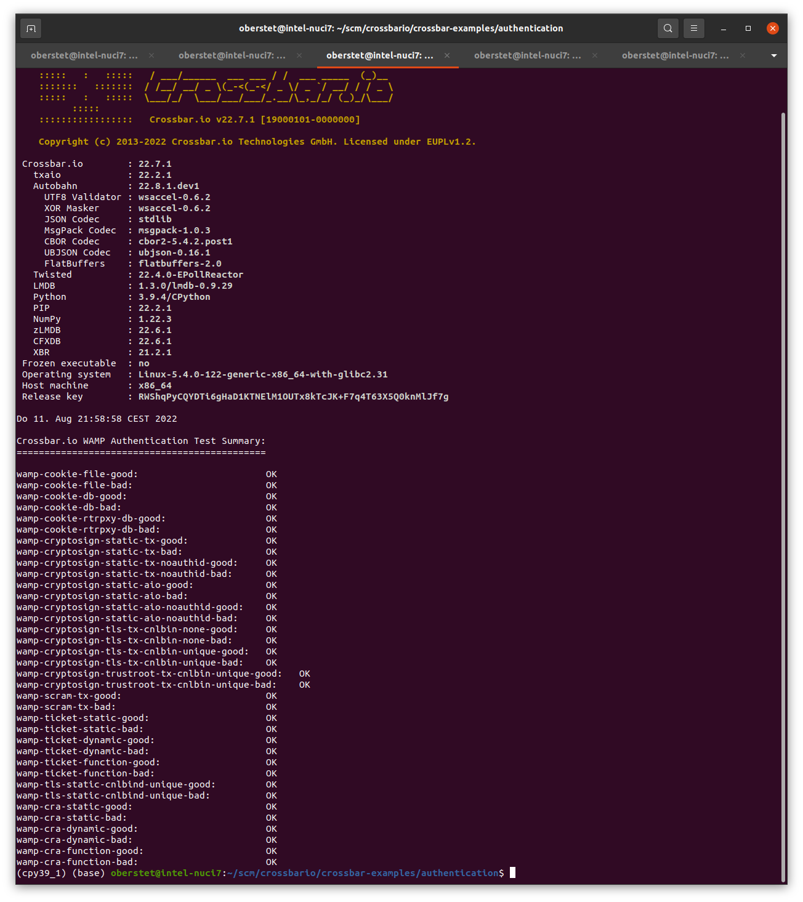

# WAMP-cryptosign with certificates and trustroot

## Testing

Start Crossbar.io using the node configuration [config-standalone.json](.crossbar/config-standalone.json)

```
make crossbar_standalone
```

> You should see the text `starting STANDALONE-realm with WAMP realm name "realm1" using router local realm_id realm001` in a log message when the node boots.

**OR** start with the node configuration [config-shared.json](.crossbar/config-shared.json)

```
make crossbar_shared
```

> You should see the text `starting ETH-realm with WAMP realm name "0x66290fA8ADcD901Fd994e4f64Cfb53F4c359a326" using router local realm_id realm001` in a log message when the node boots.


**AND** run a client (from a new terminal) using

```
make client_good
```

**OR** run a client that fails to authenticate successfully:

```
make client_bad
```

These tests are also integrated into the [automated CI tests](https://github.com/crossbario/crossbar-examples/blob/master/authentication/test_cryptosign.sh) for WAMP-Cryptosign authentication:

```
cd crossbar-examples/authentication
make test_all
```




## Test Accounts

All key pairs, both WAMP-Cryptosign and Ethereum, for this demo are generated from one seedphrase defined in the [Makefile](Makefile)

```python
seedphrase = "avocado style uncover thrive same grace crunch want essay reduce current edge"
```

From this seedphrase, an in-memory security module with multiple Ethereum and WAMP-Cryptosign keys can be created:

```python
sm: SecurityModuleMemory = SecurityModuleMemory.from_seedphrase(seedphrase, num_eth_keys=10, num_cs_keys=6)
await sm.open()
```

The 16 keys (asymmetric key pairs of private and public keys) generated in the security module for this demo are 10 Ethereum keys and 6 Cryptosign keys:

| Key No.     | Key Type    | Variable            | Usage                     | Authority
|-------------|-------------|---------------------|---------------------------|------------------
| 0           | Ethereum    | -                   | *unused*                  | -
| 1           | Ethereum    | `root_ca1_ekey`     | Root CA Owner             | **User 1**
| 2           | Ethereum    | `relay_ca1_ekey`    | Relay CA Owner            | User 2
| 3           | Ethereum    | `relay_ca2_ekey`    | Relay CA Owner            | User 3
| 4           | Ethereum    | `gateway_ca1_ekey`  | Gateway CA Owner          | User 4
| 5           | Ethereum    | `gateway_ca2_ekey`  | Gateway CA Owner          | User 5
| 6           | Ethereum    | `relay_ep1_ekey`    | Relay Endpoint            | User 2
| 7           | Ethereum    | `relay_ep2_ekey`    | Relay Endpoint            | User 3
| 8           | Ethereum    | `gateway_ep1_ekey`  | Gateway Endpoint          | User 4
| 9           | Ethereum    | `gateway_ep2_ekey`  | Gateway Endpoint          | User 5
| 10          | Cryptosign  | `relay_dl1_ckey`    | Relay Node                | User 2
| 11          | Cryptosign  | `relay_dl2_ckey`    | Relay Node                | User 3
| 12          | Cryptosign  | `gateway_dl1_ckey`  | Gateway Node              | User 4
| 13          | Cryptosign  | `gateway_dl2_ckey`  | Gateway Node              | User 5
| 14          | Cryptosign  | -                   | *unused*                  | -
| 15          | Cryptosign  | -                   | *unused*                  | -

The keys can be accessed from the security module using the *Key No.*:

```python
# Ethereum key pair used to sign the root CA certificate with
root_ca1_ekey: EthereumKey = sm[1]
```

and used to sign certificates

```python
# create and sign root CA certificate
certificate = EIP712AuthorityCertificate(...)
signature = await cert.sign(root_ca1_ekey, binary=True)
```

## Test Certificates

To create a new self-signed *Root CA Certificate* you can use the included script [generate_certificates.py](generate_certificates.py)

```console
(cpy39_1) (base) oberstet@intel-nuci7:~/scm/crossbario/crossbar-examples/authentication/cryptosign/trustroot$ make generate_certificates
python generate_certificates.py --debug \
	--seedphrase="avocado style uncover thrive same grace crunch want essay reduce current edge" \
	--realm=0x72b3486d38E9f49215b487CeAaDF27D6acf22115 \
	--outdir=./.crossbar/
2022-08-10T23:43:27+0200 EIP712AuthorityCertificate issued by 0xf5173a6111B2A6B3C20fceD53B2A8405EC142bF6 for subject 0xf5173a6111B2A6B3C20fceD53B2A8405EC142bF6 saved to "./.crossbar/root_ca1.crt"
2022-08-10T23:43:27+0200 EIP712AuthorityCertificate issued by 0xf5173a6111B2A6B3C20fceD53B2A8405EC142bF6 for subject 0xecdb40C2B34f3bA162C413CC53BA3ca99ff8A047 saved to "./.crossbar/relay_ca1.crt"
2022-08-10T23:43:27+0200 EIP712AuthorityCertificate issued by 0xecdb40C2B34f3bA162C413CC53BA3ca99ff8A047 for subject 0xeD22Fd82230B613a638e09E90dfBFeE6d604D3D2 saved to "./.crossbar/relay_ep1.crt"
2022-08-10T23:43:27+0200 Main loop terminated.
```

This will use the provided BIP-39 seedphrase ("Mnemonic") to generate security module keys from (both Ethereum and Cryptosign).
The index within these auto-generated (Ethereum) key which we will use is specified using `--keyno=0`.
The certificate will have an `issuer` with address matching this key, and since we generate a Root CA certificate, the
certificate will be self-signed, and hence `subject` will match that same address.

To read certificate files and print information from the loaded certificates:

```
(cpy39_1) (base) oberstet@intel-nuci7:~/scm/crossbario/crossbar-examples/authentication/cryptosign/trustroot$ make print_certificates
python print_certificates.py
Loaded certificate with hash a695cbb338aebc7ee66826251bb2df46996b9d50d36317141a3d9f161316e836 by issuer 0xecdb40C2B34f3bA162C413CC53BA3ca99ff8A047 with 1 signatures:

{'domain': {'name': 'WMP', 'version': '1'},
 'message': {'capabilities': 12,
             'chainId': 1,
             'issuer': '0xecdb40C2B34f3bA162C413CC53BA3ca99ff8A047',
             'meta': '',
             'realm': '0x72b3486d38E9f49215b487CeAaDF27D6acf22115',
             'subject': '0xeD22Fd82230B613a638e09E90dfBFeE6d604D3D2',
             'validFrom': 15321256,
             'verifyingContract': '0xf766Dc789CF04CD18aE75af2c5fAf2DA6650Ff57'},
 'primaryType': 'EIP712AuthorityCertificate',
 'types': {'EIP712AuthorityCertificate': [{'name': 'chainId',
                                           'type': 'uint256'},
                                          {'name': 'verifyingContract',
                                           'type': 'address'},
                                          {'name': 'validFrom',
                                           'type': 'uint256'},
                                          {'name': 'issuer', 'type': 'address'},
                                          {'name': 'subject',
                                           'type': 'address'},
                                          {'name': 'realm', 'type': 'address'},
                                          {'name': 'capabilities',
                                           'type': 'uint64'},
                                          {'name': 'meta', 'type': 'string'}],
           'EIP712Domain': [{'name': 'name', 'type': 'string'},
                            {'name': 'version', 'type': 'string'}]}}

Loaded certificate with hash ce21b90a2cb3f043383283c611bd435e8a1f1beea4b171ee652aff3576a74421 by issuer 0xf5173a6111B2A6B3C20fceD53B2A8405EC142bF6 with 1 signatures:

{'domain': {'name': 'WMP', 'version': '1'},
 'message': {'capabilities': 62,
             'chainId': 1,
             'issuer': '0xf5173a6111B2A6B3C20fceD53B2A8405EC142bF6',
             'meta': '',
             'realm': '0x72b3486d38E9f49215b487CeAaDF27D6acf22115',
             'subject': '0xecdb40C2B34f3bA162C413CC53BA3ca99ff8A047',
             'validFrom': 15321256,
             'verifyingContract': '0xf766Dc789CF04CD18aE75af2c5fAf2DA6650Ff57'},
 'primaryType': 'EIP712AuthorityCertificate',
 'types': {'EIP712AuthorityCertificate': [{'name': 'chainId',
                                           'type': 'uint256'},
                                          {'name': 'verifyingContract',
                                           'type': 'address'},
                                          {'name': 'validFrom',
                                           'type': 'uint256'},
                                          {'name': 'issuer', 'type': 'address'},
                                          {'name': 'subject',
                                           'type': 'address'},
                                          {'name': 'realm', 'type': 'address'},
                                          {'name': 'capabilities',
                                           'type': 'uint64'},
                                          {'name': 'meta', 'type': 'string'}],
           'EIP712Domain': [{'name': 'name', 'type': 'string'},
                            {'name': 'version', 'type': 'string'}]}}

Loaded certificate with hash 442f7ba7960a43a71dd37e7793d99d668dce82384f87a7be4bbd358cb52d5f14 by issuer 0xf5173a6111B2A6B3C20fceD53B2A8405EC142bF6 with 1 signatures:

{'domain': {'name': 'WMP', 'version': '1'},
 'message': {'capabilities': 63,
             'chainId': 1,
             'issuer': '0xf5173a6111B2A6B3C20fceD53B2A8405EC142bF6',
             'meta': '',
             'realm': '0x72b3486d38E9f49215b487CeAaDF27D6acf22115',
             'subject': '0xf5173a6111B2A6B3C20fceD53B2A8405EC142bF6',
             'validFrom': 15321256,
             'verifyingContract': '0xf766Dc789CF04CD18aE75af2c5fAf2DA6650Ff57'},
 'primaryType': 'EIP712AuthorityCertificate',
 'types': {'EIP712AuthorityCertificate': [{'name': 'chainId',
                                           'type': 'uint256'},
                                          {'name': 'verifyingContract',
                                           'type': 'address'},
                                          {'name': 'validFrom',
                                           'type': 'uint256'},
                                          {'name': 'issuer', 'type': 'address'},
                                          {'name': 'subject',
                                           'type': 'address'},
                                          {'name': 'realm', 'type': 'address'},
                                          {'name': 'capabilities',
                                           'type': 'uint64'},
                                          {'name': 'meta', 'type': 'string'}],
           'EIP712Domain': [{'name': 'name', 'type': 'string'},
                            {'name': 'version', 'type': 'string'}]}}

(cpy39_1) (base) oberstet@intel-nuci7:~/scm/crossbario/crossbar-examples/authentication/cryptosign/trustroot$
```

## Standalone Trustroots

A complete Crossbar.io node configuration using *Standalone Trustroots* can be found [here](.crossbar/config-standalone-trustroot.json).

This example configures one realm

* `realm1`

and a WebSocket listening transport with an authentication item `auth` for *WAMP-Cryptosign*

```json
{
    "cryptosign": {
        "type": "static",
        "trustroots": {
            "realm1": {
                "certificate": "root_ca1.crt"
            }
        }
    }
}
```

The `trustroots` item for `cryptosign` configures a map from realm names (here only `realm1`) to files with WAMP EIP712  *Root CA Certificates*

* `root_ca1.crt`

These certificate filenames are relative to the Crossbar.io node directory (`.crossbar`), and are binary files which contain the CBOR serialized certificate and signature `[certificate, signature]`.


## Shared Trustroots

Write me.
