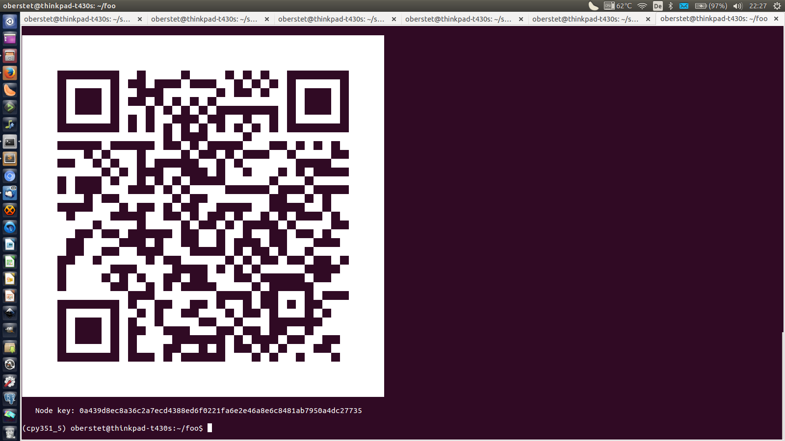

# Crossbar.io DevOps Center API

The public API is used by clients of **Crossbar.io DevOps Center (CDC)**. Calls to CDC may result in private API calls.

Since this API may be used by clients other than our own, it should be stable.

All calls are within the management realm to which the session issuing the calls is connected.


## Management Realms

A management realm is a realm on CDC dedicated to one larger system of a customer with potentially many thousand Crossbar.io nodes attached to and many thousand CDC API clients, like customer operators or tools.

Each management realm is fully isolated from all other management realms, serving different WAMP routing namespaces and with CDC backends running in dedicated processes, effectively preventing any data leakage.

## Authentication

Both Crossbar.io nodes and CDC API clients authenticate to CDC via WAMP-cryptosign.

WAMP-cryptosign is a public-private key authentication mechanism based on elliptic curve Curve25519, namely it adopts [Ed25519](http://ed25519.cr.yp.to/) to authenticate WAMP peers.

### User Authentication

For CDC API clients, the public-private keys are generated by the user with `ssh-keygen`, which is part of the standard OpenSSH package:

```console
ssh-keygen -t ed25519 -f mykey
```

> **Important: do NOT set a passphrase.** For simple use (like demonstrated here), keys should be protected using filesystem permissions, but otherwise not protected by a passphrase. To use a passphrase with your key, load and unlock your key into OpenSSH agent and use the agent support built into Autobahn for WAMP-cryptosign authentication.

Above will generate 2 files:

* `mykey` - the **private** user key (OpenSSH format)
* `mykey.pub` - the **public** user key (OpenSSH format)

Users are assigned one of the following authentication roles on the respective management realm upon successfull authentication:

* `cdc-guest`
* `cdc-devop`
* `cdc-admin`
* `cdc-owner`

### Node Authentication

For Crossbar.io nodes, the public-private keys are automatically generated when a node first starts:

* `CBDIR/.crossbar/key.priv` - the **private** node key (Crossbar.io format)
* `CBDIR/.crossbar/key.pub` - the **public** node key (Crossbar.io format)

Crossbar.io nodes need to be **paired** with CDC first. The node pairing makes the node's public key known to CDC, associates the node with a **management realm** and assign a node ID to the node.

> The node ID is identical to the WAMP `authid` assigned by CDC during the authentication to the Crossbar.io node.

All Crossbar.io nodes are assigned the authentication role

* `cdc-node`

on the respective management realm after successfull authentication.

### CDC Pairing

#### Manual

During the alpha-testing of the first CDC ready Crossbar.io release 16.10, pairing of Crossbar.io nodes and CDC API clients with CDC is not yet available and provisioning of new management realms and users involves some manual steps beginning with sending us

* your desired **management realm name**,
* the **owner's user public key** (OpenSSH format) and
* optionally, one or more **Crossbar.io node public keys** (Crossbar.io format) and
* optionally, one or more **CDC API client public keys** (OpenSSH format)

Drop us an email at **`support at crossbario dot com`** with subject line **`alpha-16.10`** and we'll setup your management realm on our CDC alpha hosting service and provide you access from Web UIs, command line tools or programmatic and remote access to your Crossbar.io nodes.

#### API based

With API based pairing, the owner of a management realm will be able to call CDC procedures which add, provision and configure Crossbar.io node public keys and CDC API client public keys allowed access to that management realm.

The management realm owner's key pair should be protected well, and only used to create day to day key pairs for administrators of the management realm itself.

The API (preliminary) may look like

```
com.crossbario.cdc.register_user@1(<user_name>, <user_email>, <user_pub_key>) -> <registration_id|int>
```

to initiate registration of a new user providing a user name, email and first public key. The user name is checked that is does not yet exist and meets the requirements for user names. When these conditions are met, a challenge in form of a graphical captcha with an embedded, five digit numeric PIN is sent via email to the email address provided.

The user will need to read the PIN from the captcha and enter that allowing to make the call to

```
com.crossbario.cdc.verify_user_registration(<registration_id|int>, <pin|int>) -> <OK>
```

When this call returns successfully, the user is created.

To register more public keys for the user, calls abovr procedure again. This will send a challenge as well and proceed exactly like above.

To register a new management realm, a similar API is available:

```
com.crossbario.cdc.register_management_realm(<management_realm>, <owner_pub_key>) -> <registration_id|int>
```

to initiate registration of a new management realm providing the management realm name and owner's public key,

The public key must have been registered before for a user,

The registering owner's email address is already known, and used for sending a captcha with a PIN like above to the owner. Verification is similar:

```
com.crossbario.cdc.verify_management_realm_registration(<registration_id|int>, <pin|int>) -> <OK>
```

When this call returns successfully, the management realm is created.

The owner of the management realm can manage the realm by allowing new Crossbar.io node public keys and CDC API client public keys access to the management realm under respective roles.


### Displaying keys

The Crossbar.io release key (which changes with each release) is displayed together with version information

```console
(cpy351_5) oberstet@thinkpad-t430s:~$ crossbar version
     __  __  __  __  __  __      __     __
    /  `|__)/  \/__`/__`|__) /\ |__)  |/  \
    \__,|  \\__/.__/.__/|__)/~~\|  \. |\__/

 Crossbar.io        : 16.10.dev1
   Autobahn         : 0.16.0 (with JSON, MessagePack, CBOR, UBJSON)
   Twisted          : 16.3.0-EPollReactor
   LMDB             : 0.89/lmdb-0.9.18
   Python           : 3.5.1/CPython
 OS                 : Linux-3.13.0-92-generic-x86_64-with-debian-jessie-sid
 Machine            : x86_64
 Release key        : RWQ2MDk26PKBMNUZG2Jok1tMBB1SKyci+N7dtcep8jrikTl4NvI1Rnux
```

The node public key is printed when the node starts:

```console
(cpy351_5) oberstet@thinkpad-t430s:~/foo$ crossbar start
2016-08-14T22:25:45+0200 [Controller  20410] New node key pair generated!
2016-08-14T22:25:45+0200 [Controller  20410] File permissions on node public key fixed!
2016-08-14T22:25:45+0200 [Controller  20410] File permissions on node private key fixed!
2016-08-14T22:25:45+0200 [Controller  20410] Node configuration loaded from 'config.json'
2016-08-14T22:25:45+0200 [Controller  20410]      __  __  __  __  __  __      __     __
2016-08-14T22:25:45+0200 [Controller  20410]     /  `|__)/  \/__`/__`|__) /\ |__)  |/  \
2016-08-14T22:25:45+0200 [Controller  20410]     \__,|  \\__/.__/.__/|__)/~~\|  \. |\__/
2016-08-14T22:25:45+0200 [Controller  20410]
2016-08-14T22:25:45+0200 [Controller  20410]     Crossbar.io Version: 16.10.dev1
2016-08-14T22:25:45+0200 [Controller  20410]     Node Public Key: 0a439d8ec8a36c2a7ecd4388ed6f0221fa6e2e46a8e6c8481ab7950a4dc27735
2016-08-14T22:25:45+0200 [Controller  20410]
2016-08-14T22:25:45+0200 [Controller  20410] Running from node directory '/home/oberstet/foo/.crossbar'
```

There is also a new `crossbar keys` command which prints both the release and node key in hex and as a qr code for scanning:




## Tutorial

### Connect to CDC

Connecting to CDC and retrieving the management realm status:

```python
from twisted.internet.defer import inlineCallbacks
import util

@inlineCallbacks
def main(session, details):
    try:
        status = yield session.call(u'com.crossbario.cdc.general.get_status@1')
    except:
        session.log.failure()
    else:
        session.log.info('Connected to CDC management realm "{realm}" (current time at CDC is {now})',
                         realm=status[u'realm'], now=status[u'now'])

util.run(main)
```

Here is a sample run:

```console
(cpy352_2) oberstet@office-corei7:~/scm/crossbario/crossbarexamples/cdc$ python tut1.py
2016-08-13T16:16:48+0200 Connected to CDC management realm "com.crossbario.cdc.mrealm-test1" (current time at CDC is 2016-08-13T14:16:48.414Z)
2016-08-13T16:16:48+0200 Main loop terminated.
```

### Get Crossbar.io nodes

Connecting to CDC, getting a list of Crossbar.io nodes provisioned on that realm and retrieving the current status of each node:

```python
from twisted.internet.defer import inlineCallbacks
import util

@inlineCallbacks
def main(session, details):
    try:
        # get list of node_ids of Crossbar.io nodes provisioned on this management realm
        nodes = yield session.call(u'com.crossbario.cdc.management.get_nodes@1')

        for node_id in nodes:
            # get node status given node_id
            node_status = yield session.call(u'com.crossbario.cdc.management.get_node_status@1', node_id)
            session.log.info('Node "{node_id}" status: {node_status}', node_id=node_id, node_status=node_status)

            if node_status[u'status'] == u'online':
                # if the node is online, get node controller status
                node_info = yield session.call(u'com.crossbario.cdc.remote.get_controller_info@1', node_id)
                session.log.info('Node "{node_id}" info: {node_info}', node_id=node_id, node_info=node_info)
    except:
        session.log.failure()

util.run(main)
```

Here is a sample run:

```console
(cpy351_5) oberstet@thinkpad-t430s:~/scm/crossbario/crossbarexamples/cdc$ python tut2.py
2016-08-14T22:55:47+0200 Node "node0" status: {'heartbeat_time': '2016-08-14T20:55:47.356Z', 'heartbeat': 21, 'status': 'online', 'extra': {'foo': 42, 'bar': 'baz'}, 'node_id': 'node0'}
2016-08-14T22:55:47+0200 Node "node0" info: {'threads': 2, 'files': [], 'sockets': [{'status': 'ESTABLISHED', 'remote': '127.0.0.1:8080', 'local': '127.0.0.1:46277', 'type': 'tcp4'}], 'descriptors': 20}
2016-08-14T22:55:47+0200 Node "node1" status: {'heartbeat_time': '2016-08-14T20:55:47.209Z', 'heartbeat': 22, 'status': 'online', 'extra': {'foo': 23, 'bar': 'moo'}, 'node_id': 'node1'}
2016-08-14T22:55:47+0200 Node "node1" info: {'threads': 2, 'files': [], 'sockets': [{'status': 'ESTABLISHED', 'remote': '127.0.0.1:8080', 'local': '127.0.0.1:46276', 'type': 'tcp4'}], 'descriptors': 12}
2016-08-14T22:55:48+0200 Main loop terminated.
```

### Tap worker log output

Here is how to remotely retrieve the log history of a worker and tap into the live, real-time log output of that worker:

```python
from twisted.internet.defer import inlineCallbacks
from autobahn.twisted.util import sleep
import util

NODE_ID = u'node0'
WORKER_ID = u'worker-002'

@inlineCallbacks
def main(session, details):
    try:
        print('Worker {} on node {} log history:'.format(WORKER_ID, NODE_ID))
        log = yield session.call(u'com.crossbario.cdc.remote.get_worker_log@1', NODE_ID, WORKER_ID, 30)
        for log_rec in log:
            print(log_rec)

        print('Listening to live log output ..')
        log_topic = u'com.crossbario.cdc.node.{}.worker.{}.on_log'.format(NODE_ID, WORKER_ID)

        def on_worker_log(*args, **kwargs):
            print(args, kwargs)

        sub = yield session.subscribe(on_worker_log, log_topic)
    except:
        session.log.failure()
    else:
        yield sleep(15)

util.run(main)
```

Here is a sample run:

```console
(cpy351_5) oberstet@thinkpad-t430s:~/scm/crossbario/crossbarexamples/cdc$ python tut3.py
2016-08-14T22:49:01+0200 Worker worker-002 on node node0 log history:
2016-08-14T22:49:01+0200 {'tick': 69, 'topic': 'com.example.on_tick', 'log_time': 1471207691.458671}
2016-08-14T22:49:01+0200 {'tick': 70, 'topic': 'com.example.on_tick', 'log_time': 1471207696.4648347}
2016-08-14T22:49:01+0200 {'tick': 71, 'topic': 'com.example.on_tick', 'log_time': 1471207701.470919}
2016-08-14T22:49:01+0200 {'tick': 72, 'topic': 'com.example.on_tick', 'log_time': 1471207706.474243}
2016-08-14T22:49:01+0200 {'tick': 73, 'topic': 'com.example.on_tick', 'log_time': 1471207711.4786506}
2016-08-14T22:49:01+0200 {'tick': 74, 'topic': 'com.example.on_tick', 'log_time': 1471207716.4829242}
2016-08-14T22:49:01+0200 {'tick': 75, 'topic': 'com.example.on_tick', 'log_time': 1471207721.4865615}
2016-08-14T22:49:01+0200 {'tick': 76, 'topic': 'com.example.on_tick', 'log_time': 1471207726.4926562}
2016-08-14T22:49:01+0200 {'tick': 77, 'topic': 'com.example.on_tick', 'log_time': 1471207731.49393}
2016-08-14T22:49:01+0200 {'tick': 78, 'topic': 'com.example.on_tick', 'log_time': 1471207736.5004253}
2016-08-14T22:49:01+0200 Listening to live log output ..
2016-08-14T22:49:01+0200 ('published tick 79 to topic "com.example.on_tick"',) {}
2016-08-14T22:49:06+0200 ('published tick 80 to topic "com.example.on_tick"',) {}
2016-08-14T22:49:11+0200 ('published tick 81 to topic "com.example.on_tick"',) {}
2016-08-14T22:49:16+0200 Main loop terminated.
```

> There currently is a difference in what is returned as log line objects via these APIs - this is a bug.


### API Versioning

We are using the following scheme for API versioning:

* `com.crossbario.cdc.some_proc@1()`
* `com.crossbario.cdc.some_proc@2(<filter_status>) -> [<node_info>]` where `node_info` is a struct describing a node
* `com.crossbario.cdc.some_proc@3(<filter_type>, <filter_status>) -> {<node_id>: <node_info>}` where `node_id` is the ID of a node and `node_info` is a struct describing the node

---

## API Reference

### Global API

Procedures:

* `com.crossbario.cdc.get_status@1()` - returns management status information.
* `com.crossbario.cdc.get_nodes@1()` - returns a list of ID of Crossbar.io nodes attached to this management realm
* `com.crossbario.cdc.get_node_status@1(<node_id>) -> { // node info dict // }`

### Remote Node API

Procedures:

* `com.crossbario.cdc.remote.get_controller_status@1(<node_id>) -> { // controller info dict // }`

* **`com.crossbario.cdc.remote.shutdown_node@1`**`()`
* **`com.crossbario.cdc.remote.get_node_workers@1`**`(<node_id>)`
* **`com.crossbario.cdc.remote.get_worker_status@1`**`(<node_id>, <worker_id>) -> { // worker info dict // }`
* **`com.crossbario.cdc.remote.get_worker_log@1`**`(<node_id>, <worker_id>) -> [ // log line dicts // ]`

* **`com.crossbario.cdc.remote.start_router@1`**`(<node_id>, <router_id>, <router_config>) -> <started_at>`
* **`com.crossbario.cdc.remote.start_container@1`**`(<node_id>, <container_id>, <container_config>) -> <started_at>`
* **`com.crossbario.cdc.remote.start_guest@1`**`(<node_id>, <guest_id>, <guest_config>) -> <started_at>`

#### Native Workers

Procedures:

* **`com.crossbario.cdc.remote.shutdown_worker@1`**`(<node_id>, <worker_id>)` -

* **`com.crossbario.cdc.remote.get_worker_cpu_count@1`**
* **`com.crossbario.cdc.remote.get_worker_cpu_affinity@1`**
* **`com.crossbario.cdc.remote.set_worker_cpu_affinity@1`**

* **`com.crossbario.cdc.remote.get_worker_pythonpath@1`**
* **`com.crossbario.cdc.remote.add_worker_pythonpath@1`**

* **`com.crossbario.cdc.remote.get_worker_profilers@1`**
* **`com.crossbario.cdc.remote.start_worker_profiler@1`**
* **`com.crossbario.cdc.remote.get_worker_profile@1`**

#### Routers

Crossbar.io **router workers** listen on **transports** providing routing for **realms**.


##### Realms

A **realm** is a separate namespace and isolated routing domain.

Procedures:

* **`com.crossbario.cdc.remote.get_router_realms@1`**`(<node_id>, <router_id>)` - Get list of IDs of realms started on a router worker on a node.
* **`com.crossbario.cdc.remote.query_router_realm@1`**`(<node_id>, <router_id>, <realm_id>)` - Get detailed info on a realm started on a router worker.
* **`com.crossbario.cdc.remote.start_router_realm@1`**`(<node_id>, <router_id>, <realm_id>, <realm_config>)` - Start a new routing realm on a router worker on a node.
* **`com.crossbario.cdc.remote.stop_router_realm@1`**`(<node_id>, <router_id>, <realm_id>)` - Stop a realm currently started on a router worker on some node.

Events:

* **`com.crossbario.cdc.remote.on_router_realm@1`** - Fires when the status of a realm changes (with a tuple `(node_id, router_id, realm_id, old_status, new_status)` an event payload).


##### Roles

Clients connecting are authenicated under **roles** on **realms**.

Procedures:

* **`com.crossbario.cdc.remote.get_realm_roles@1`**`(<node_id>, <router_id>, <realm_id>)` - Get list of IDs of roles started on a realm on a router worker on a node.
* **`com.crossbario.cdc.remote.query_realm_role@1`**`(<node_id>, <router_id>, <realm_id>, <role_id>)` - Get detailed info on a role started on a routing realm.
* **`com.crossbario.cdc.remote.start_realm_role@1`**`(<node_id>, <router_id>, <realm_id>, <role_id>, <role_config>)` - Start a new role on a routing realm.
* **`com.crossbario.cdc.remote.stop_realm_role@1`**`(<node_id>, <router_id>, <realm_id>, <role_id>)` - Stop a role running on a routing realm.

Events:

* **`com.crossbario.cdc.remote.on_router_role@1`** - Fires when the status of a role changes (with a tuple `(node_id, router_id, realm_id, role_id, old_status, new_status)`

##### Grants

A **role** on a **realm** provides **grants** to clients.

Procedures:

* **`com.crossbario.cdc.remote.get_role_grants@1`**
* **`com.crossbario.cdc.remote.query_role_grant@1`**
* **`com.crossbario.cdc.remote.start_role_grant@1`**
* **`com.crossbario.cdc.remote.stop_role_grant@1`**

Events:

* `com.crossbario.cdc.remote.on_role_grant@1` - (node_id, router_id, realm_id, role_id, old_status, new_status)

##### Transports

Routers run listening **transports** for clients to connect.

Procedures:

* **`com.crossbario.cdc.remote.get_router_transports@1`**
* **`com.crossbario.cdc.remote.query_router_transport@1`**
* **`com.crossbario.cdc.remote.start_router_transport@1`**
* **`com.crossbario.cdc.remote.stop_router_transport@1`**

##### Transport Resources

Certain transports like Web can host **resources**.

Procedures:

* **`com.crossbario.cdc.remote.get_transport_resources@1`**
* **`com.crossbario.cdc.remote.query_transport_resource@1`**
* **`com.crossbario.cdc.remote.start_transport_resource@1`**
* **`com.crossbario.cdc.remote.stop_transport_resource@1`**

##### Components

Router can optionally host WAMP application **components**.

Procedures:

* **`com.crossbario.cdc.remote.get_router_components@1`**
* **`com.crossbario.cdc.remote.query_router_component@1`**
* **`com.crossbario.cdc.remote.start_router_component@1`**
* **`com.crossbario.cdc.remote.stop_router_component@1`**


#### Containers

##### Global

Procedures:

* **`com.crossbario.cdc.remote.stop_container@1`**

##### Container Components

Procedures:

* **`com.crossbario.cdc.remote.get_container_components@1`**
* **`com.crossbario.cdc.remote.query_container_component@1`**
* **`com.crossbario.cdc.remote.start_container_component@1`**
* **`com.crossbario.cdc.remote.stop_container_component@1`**

* **`com.crossbario.cdc.remote.restart_container_component@1`**
