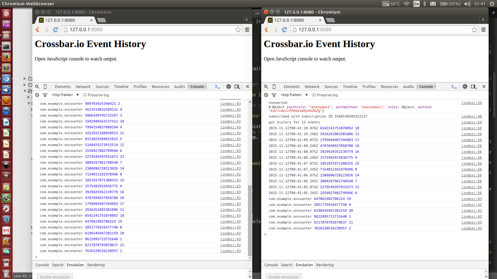

# Event History

This example demonstrates **event history** with Crossbar.io. Event history is a feature of the WAMP Advanced Profile and allows subscribers to catch up on missed events when reconnecting or to generally retrieve event history on subscriptions.

Here are two browser clients both subscribing to a topic, and each publishing to the topic periodically. The client on the right side just reconnected, and retrieved an initial event history of length 12:



Currently, the only store type implemented is "memory" which just stores event history in objects in memory.

Hence, the price for event history with the "memory" store type is memory consumption. There isn't any significant performance cost for publish & subscribe actions.

We will have a second store type "lmdb" which stores event history in a LMDB embedded database. The price for event history with the "lmdb" store type will be disk usage and a bit of performance for publish & subscribe actions.


## How it works

Event history needs to be enable in the Crossbar.io node configuration. Specifically, you need to add a "store" section to the realm you want to have event history on:

```json
{
   "name": "realm1",
   "roles": [
   ],
   "store": {
      "type": "memory",
      "event-history": [
         {
            "uri": "com.example.oncounter",
            "limit": 10000
         }
      ]
   }
}
```

Above is (part of) a realm configuration as part of a Crossbar.io node configuration.

* The "store" section defines a memory backed store - that is a store which is transient across restarts of Crossbar.io.
* The "event-history" section contains a list of URIs or URI patterns for which to keep history, as well as the "limit" to the history to be held

The JavaScript client then calls into the WAMP meta API `wamp.subscription.get_events` with a `subscription_id` and a `limit` to retrieve event history:

```javascript
session.subscribe('com.example.oncounter',
   function (args, kwargs, details) {
      console.log('com.example.oncounter', details.publication, args[0]);
   }
).then(
   // .. when subscription is successful, we get back a subscription object
   function (sub) {
      console.log("subscribed with subscription ID " + sub.id);

      // get event history of length 5 on given subscription
      //
      session.call('wamp.subscription.get_events', [sub.id, 12]).then(
         function (history) {
            console.log("got history for " + history.length + " events");
            for (var i = 0; i < history.length; ++i) {
               console.log(history[i].timestamp, history[i].publication, history[i].args[0]);
            }
         },
         function (err) {
            console.log("could not retrieve event history", err);
         }
      );
   },
   function (err) {
      console.log("could not subscribe", err);
   }
);
```

The permission to retrieve event history depends on two factors: the clients has to be allowed to call `wamp.subscription.get_events` and the client must be permitted to subscribe to the respective subscription. Only then it not only actually gets handed out the subscription ID, but also the `wamp.subscription.get_events` will in turn dynamically authorize the retrieval of event history.

In other words, the right to subscribe implies the right to retrieve event history.


## Try yourself

To try yourself, go to this directory and start Crossbar.io

    crossbar start

Then open two browser tabs at [http://localhost:8080](http://localhost:8080) and press F12 to open the JavaScript console. Hit F5 to reload a browser tab and look at the initial event history retrieved.
