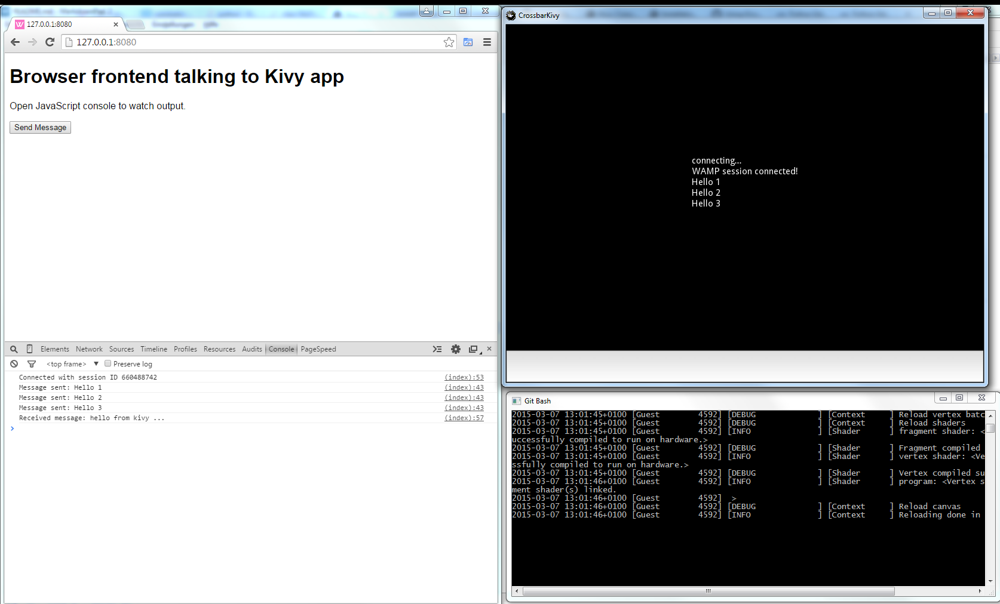

# Writing Kivy apps using Crossbar.io

This is an example of how to use Crossbar.io and WAMP with [Kivy](http://kivy.org/) apps.


## Install Kivy

To install Kivy into an existing Python installation which already has Crossbar.io, you can get prebuilt wheels for Windows here:

* http://www.lfd.uci.edu/~gohlke/pythonlibs/#pygame
* http://www.lfd.uci.edu/~gohlke/pythonlibs/#kivy

To install:

```
pip install pygame‑1.9.2a0‑cp27‑none‑win32.whl
pip install Kivy‑1.8.0‑cp27‑none‑win32.whl
```

## Running

To run the demo:

```
crossbar start
```

This will startup a Kivy based UI.

Open your Web browser at `http://localhost:8080`.

You now can send message between the browser and Kivy UI:


