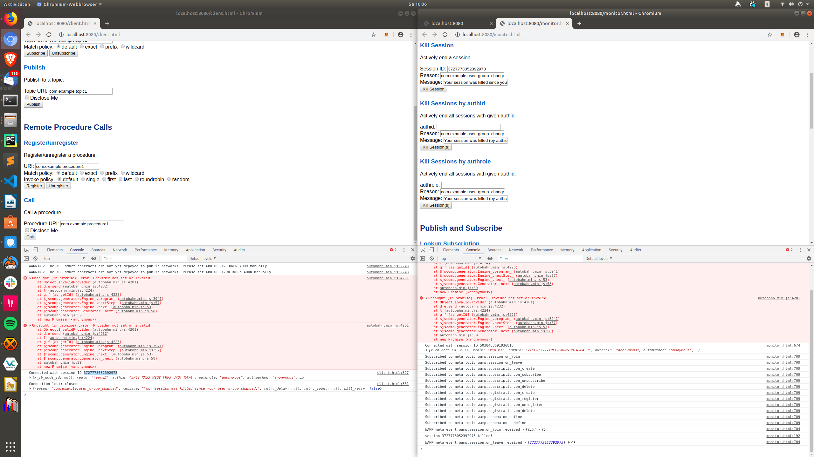
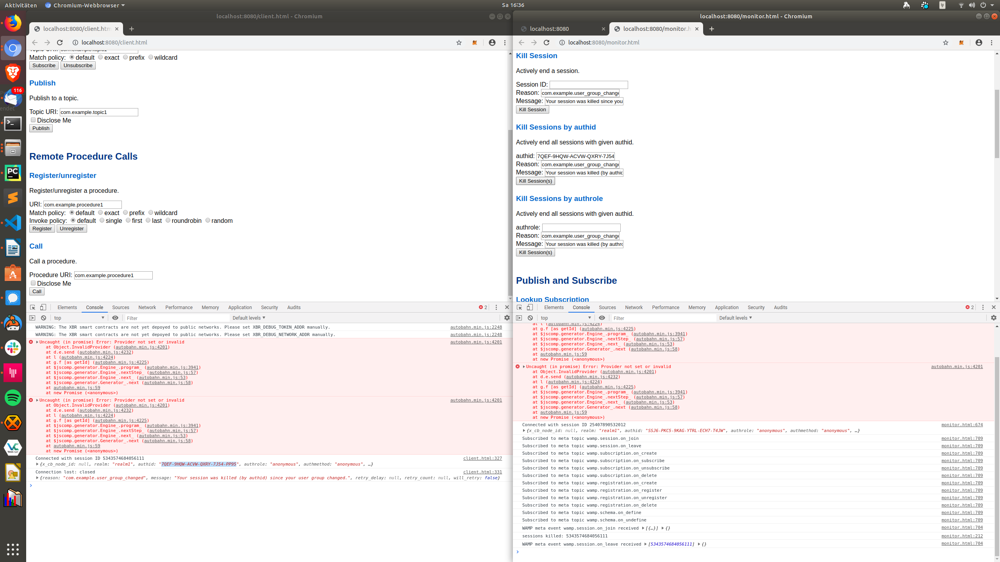
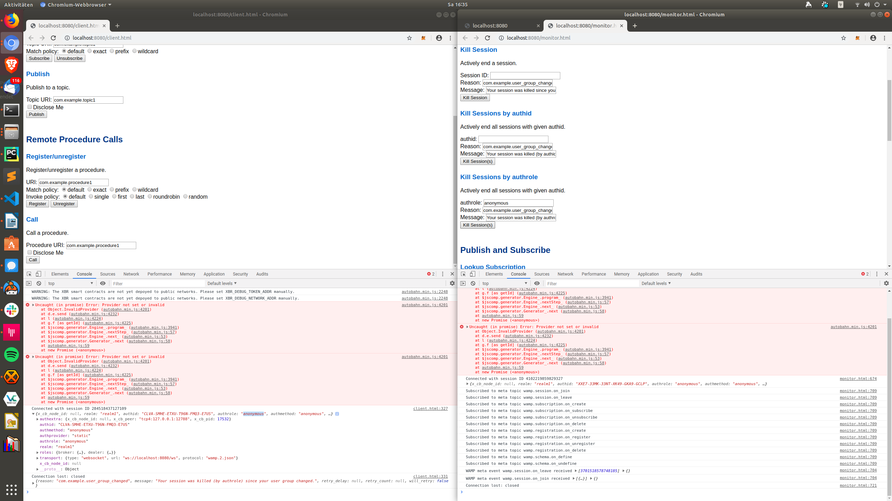

This examples illustrates meta-events and meta-procedures.

Meta-events allow subscribers to receive information about the lifecycle of sessions, subscriptions and registrations.

Meta-procedures allow retrieving information about currently existing sessions, subscriptions and registrations.

For more information see the [Crossbar.io documentation](http://crossbar.io/docs/WAMP-Features/).

## How to run this

You need to have Crossbar.io installed.

Then in this directory just do

`crossbar start`

and open 

`http://localhost:8080`

in your browser.

Open the JavaScript console to get logging output.

### Killing sessions

