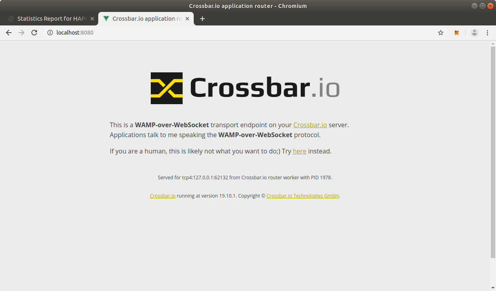

# CrossbarFX HA test

> This requires Crossbar.io >= 19.10.1

[Enable "Show timestamps" in Chrome](https://stackoverflow.com/a/24260317/884770)

## High availability

### Testing

The folder [ha_setup](ha_setup) contains example configurations of 4 Crossbar.io nodes.

> All nodes are started on localhost for easy testing - in production, the Crossbar.io nodes should run on 4 different machines obviously.

To start the 4 nodes, open 4 terminals and run

```
make run_ha_node1
```

in each of them, using the 4 targets `make run_ha_node1`, `make run_ha_node2`, `make run_ha_node3` and `make run_ha_node4`.

Now install [HAProxy](https://www.haproxy.org/)

```
make install_haproxy
```

and start the load balancer using

```
(cpy374_1) oberstet@intel-nuci7:~/scm/crossbario/crossbar-examples/rlinks/router_cluster$ make run_haproxy
haproxy -f haproxy.conf
[WARNING] 263/160453 (6888) : Health check for server crossbar_nodes/node1 succeeded, reason: Layer4 check passed, check duration: 0ms, status: 3/3 UP.
[WARNING] 263/160453 (6888) : Health check for server crossbar_nodes/node2 succeeded, reason: Layer4 check passed, check duration: 0ms, status: 3/3 UP.
[WARNING] 263/160454 (6888) : Health check for server crossbar_nodes/node3 succeeded, reason: Layer4 check passed, check duration: 0ms, status: 3/3 UP.
[WARNING] 263/160454 (6888) : Health check for server crossbar_nodes/node4 succeeded, reason: Layer4 check passed, check duration: 0ms, status: 3/3 UP.
```

Finally, open the HAproxy statistics page configured at [http://localhost:1936/](http://localhost:1936/).

You should see a page similar to


Now open [http://localhost:8080/](http://localhost:8080/) and reload (hit F5) quickly a couple of times



Notice that this line

```
Served for tcp4:127.0.0.1:62132 from Crossbar.io router worker with PID 1978.
```

changes as you reload, showing that HAProxy forwards the connection to different backend nodes.

When you now reload the HAProxy statistics page, should see something similar to


In particular, note the changed value of the **Max** connection count column in the **crossbar_nodes** table (jumped from previously 0 to now 1 for all 4 backend nodes).

---


# FIXME


Nodes:

* node1: 3a88bcd446482d38dd492b9a4b285a560659abffed3ec73920b277767e802f6c
* node2: b45d9693346a5327f2b7f59b9fc04f2822b18c2be970938ea53564003aa2083d
* node3: d7bbb7cd07b027f18674bcec8489a6618b5ace07e861c929cff0a7659f816f5f
* node4: 252b6adc61db6d4744b65060a81f667f5062dbf94a3fac362956cac78b878620


python main.py --silent --duration 300 --period 10 --clients 8 --connections 40 --loops 1 --rate 2 --stride 1 --size 128
=> 400Mb/sec, 200k events/sec

python main.py --silent --duration 300 --period 10 --clients 8 --connections 32 --loops 1 --rate 10 --stride 1 --size 512


632Mb

>>>> 8*32
256
>>>> 8*32*10
2560
>>>> 8*32*10*256
655360
>>>> 8*32*10*256*512
335544320
>>>> 8*32*10*256*512/1024/1024
320.0
>>>>


python main.py --silent --duration 60 --period 10 --clients 8 --connections 16 --loops 1 --rate 5 --stride 1 --size 4096
python main.py --silent --duration 60 --period 10 --clients 8 --connections 16 --loops 1 --rate 1 --stride 8 --size 4096
python main.py --silent --duration 120 --period 10 --clients 8 --connections 32 --loops 1 --rate 4 --stride 1 --size 128


```
(pypy3_1) oberstet@intel-nuci7:~/scm/crossbario/crossbarfx/test/benchmark/router_cluster$ python main.py --duration 5 --period 1 --clients 1 --connections 1 --loops 1 --rate 1 --stride 1 --size 512
Client with PID 24286 starting ..
Started clients with PIDs [24288]
Client with PID 24288 starting ..
2019-03-05T19:57:09+0100 publisher0.0 connected [batch="78fbc10a-2a55-421e-b677-19140677ae37"]: SessionDetails(realm=<realm1>, session=2306096914579341, authid=<M9HL-79YM-QGWP-4X37-P395-Y5EW>, authrole=<anonymous>, authmethod=anonymous, authprovider=static, authextra={'x_cb_node_id': None, 'x_cb_peer': 'tcp4:127.0.0.1:1372', 'x_cb_pid': 20404}, resumed=None, resumable=None, resume_token=None)
2019-03-05T19:57:09+0100 publisher0.0 ready [period=1, loops=1, rate=1, stride=1, size=512, logname=publisher0.0]
2019-03-05T19:57:10+0100 LOAD: 1.24 user, 0.55 system, 0.9 mem_percent, 3.0 ctx
2019-03-05T19:57:10+0100 WAMP publisher0.0.*: 1 events received (0 forwarded), 1 events/second, 1 events published, 1 events/second
2019-03-05T19:57:11+0100 LOAD: 1.25 user, 0.55 system, 0.9 mem_percent, 3.0 ctx
2019-03-05T19:57:11+0100 WAMP publisher0.0.*: 1 events received (0 forwarded), 1 events/second, 1 events published, 1 events/second
2019-03-05T19:57:12+0100 LOAD: 1.26 user, 0.55 system, 0.9 mem_percent, 3.0 ctx
2019-03-05T19:57:12+0100 WAMP publisher0.0.*: 1 events received (0 forwarded), 1 events/second, 1 events published, 1 events/second
2019-03-05T19:57:13+0100 LOAD: 1.26 user, 0.55 system, 0.9 mem_percent, 3.0 ctx
2019-03-05T19:57:13+0100 WAMP publisher0.0.*: 1 events received (0 forwarded), 1 events/second, 1 events published, 1 events/second
2019-03-05T19:57:14+0100 publisher0.0 leaving: reason="wamp.close.transport_lost"
2019-03-05T19:57:14+0100 Main loop terminated.
```

---

# BPF

```
sudo bpftrace syscount.bt
```

* [Full-system dynamic tracing on Linux using eBPF and bpftrace](https://www.joyfulbikeshedding.com/blog/2019-01-31-full-system-dynamic-tracing-on-linux-using-ebpf-and-bpftrace.html)
* [Linux System Call Table for x86 64](http://blog.rchapman.org/posts/Linux_System_Call_Table_for_x86_64/)


## Test configuration

Tested is a configuration:

* 4 CrossbarFX edge nodes, connected to 1 CrossbarFX master node
* 2 edge nodes on each of `brummer1` and `brummer2`, the master node on `matterhorn`
* each edge node runs 1 router worker with a realm `realm1`
* all 4 router workers are connecting to each other (in a full mesh) for realm `realm1`
* the 4 router workers run a TCP-WebSocket-CBOR listening transport on `0.0.0.0:8081 - 0.0.0.0:8084`
* HAproxy runs on `matterhorn`, listening on TCP `*:8080` and forwarding to above 4 router workers (at layer 4, that is raw TCP)

The test probe runs on `matterhorn`, connecting to HAproxy at `localhost:8080` which will forward the
connection to one of the 4 router workers of the 2 nodes running on each of `brummer1` and `brummer2`.

When one of the 4 edge nodes dies, 25% of client connections will reconnect (to HAproxy) and be forwarded
to one of the 3 remaining edge nodes (the router worker of that node).

When one of the 2 boxes running edge nodes dies, 50% of client connections will reconnect and be forwarded
to one of the 2 remaining edge nodes on the surviving box.

When an edge node comes back, HAproxy will (after a short time) recognize and _new_ client connections will
be directed to the edge node that came back.

HAproxy using a "least connections" load-balancing strategy will over time again spread connections evenly
accross nodes.

> Note: it is possible of course to kill client connections, forcing them to reconnect, to speeden up the re-balancing of connections after recovery from failed nodes (or boxes).


## Increasing the FD limits

> Note: this expands on what is described in our docs in [Network Tuning](https://crossbar.io/docs/Network-Tuning/)

Modify `/etc/systemd/user.conf` and `/etc/systemd/system.conf` with the following line (this takes care of graphical login):

```console
DefaultLimitNOFILE=1048576
```

Modify `/etc/security/limits.conf` with the following lines (this takes care of non-GUI login):

```
# wildcard does not work for root, but for all other users
*               soft     nofile           1048576
*               hard     nofile           1048576
# settings should also apply to root
root            soft     nofile           1048576
root            hard     nofile           1048576
```

Modify `/etc/pam.d/common-session` and `/etc/pam.d/common-session-noninteractive` with the following line:

```
session required pam_limits.so
```

Reboot the system. You should get:

```
oberstet@intel-nuci7:~$ cat /proc/sys/fs/file-max
16777216
oberstet@intel-nuci7:~$ ulimit -n
1048576
oberstet@intel-nuci7:~$ ulimit -Hn
1048576
```


---

https://kb.novaordis.com/index.php/HAProxy_Configuration


- use struss/dtrace to measure crossbarfx
- setup haproxy

---

polling FDs on Linux 4.18+ without doing syscalls

IOCB_CMD_POLL

https://lwn.net/Articles/742978/

https://blog.cloudflare.com/io_submit-the-epoll-alternative-youve-never-heard-about/

----

subclass and override this method, getting rid
of this syscall (epoll_wait):

https://github.com/twisted/twisted/blob/c20f01967702c6941ca796cc4837791754944c1c/src/twisted/internet/epollreactor.py#L218

replace with this code that directly taps into
the ring buffer with the completions, including
our polled sockets:

https://github.com/cloudflare/cloudflare-blog/blob/930dbeaebe8df3ba169597a80de458e44f47efc3/2019-01-io-submit/aio_poll.c#L63

note that the syscalls to actually read/write from/to the sockets will still occur:

https://github.com/twisted/twisted/blob/c20f01967702c6941ca796cc4837791754944c1c/src/twisted/internet/epollreactor.py#L229

there is no "vectored IO on TCP sockets API" in linux as far as I know ..

----

https://blog.cloudflare.com/why-we-use-the-linux-kernels-tcp-stack/

https://github.com/cloudflare/cloudflare-blog/blob/master/2019-01-io-submit/aio_poll.c

https://linux.die.net/man/2/io_submit
https://linux.die.net/man/2/io_getevents

https://unix.stackexchange.com/questions/447249/linux-aio-io-submit-io-getevents-on-fifo-named-pipes

http://seastar.io/
https://github.com/scylladb/seastar
http://docs.seastar.io/master/classseastar_1_1future.html


https://github.com/mtcp-stack/mtcp


twisted.internet.kqreactor.doKEvent

calls

twisted.internet.tcp.Connection.doRead

calls

twisted.internet.protocol.dataReceived


https://github.com/twisted/twisted/blob/c20f01967702c6941ca796cc4837791754944c1c/src/twisted/internet/tcp.py#L227

https://github.com/twisted/twisted/blob/c20f01967702c6941ca796cc4837791754944c1c/src/twisted/internet/kqreactor.py#L293
